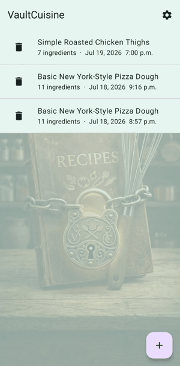

VaultCuisine

  
  

A privacy-first Android app that turns your recipe cards, either printed or handwritten into clean,
editable, structured recipes. Everything happens on-device: no cloud upload, no account, no
tracking.

Part of the Rekluz Labs app family, alongside NarraWeave.

<!--  -->
Why VaultCuisine

Recipe boxes, cookbook margins, and grandma's handwriting shouldn't have to live only on paper —
but most "recipe scanner" apps ship your photos to a server to do the work. VaultCuisine doesn't.
Scanning, text recognition, and recipe structuring all run locally on your phone.

Features

Scan any recipe whether printed or handwritten, via camera or photo import
On-device text recognition using ML Kit OCR
On-device AI structuring using Gemini Nano (via Android AICore) where supported, with a
deterministic regex-based fallback on devices without on-device GenAI support
Full editing control — every scanned recipe can be corrected after the fact:

Edit any line of text inline
Add or remove ingredient/instruction lines
Drag and drop to reorder, including moving a line between Ingredients and Instructions
Long-press menu as a precision/accessibility alternative to dragging

While I would love for this app to live 100% offline with no network calls I also plan to include an AI portion for photo recognition.
The on device software is simply not powerful enough to scan and detect handwritten recipes. It works somewhat for scanning, recognition, and structuring
of printed recipes, but to get the most benefits from this app, Google Gemini must be used to greatly improve the scanning interpretation of the recipes.
Rekluz Labs will not collect analytics, and there will be no ads, no IAP, and no subscriptions. 

How it works

Photo → ML Kit OCR → [Gemini Nano available?]
                          ├─ yes → on-device AI structuring (text or image+text)
                          └─ no  → heuristic regex structuring
                                   ↓
                          Editable recipe (review, correct, save)

Scanned recipes are never auto-finalized without a review step — since on-device OCR and small
on-device models aren't perfect (especially on handwriting), every scan lands on an editable
review screen before it's saved for good.

<h2 align="center">App Preview</h2>

  

Tech stack

Kotlin + Jetpack Compose
Room for local persistence
ML Kit Text Recognition v2 for OCR
ML Kit GenAI Prompt API (Gemini Nano via AICore) for on-device structuring
Custom heuristic parser as a fallback structuring path

Requirements

Android [X.X]+ (minSdk [XX])
On-device AI structuring requires an AICore-supported device (e.g. Pixel 9/10 series and select
other flagships). On unsupported devices, the app falls back automatically to the heuristic
parser — scanning still works everywhere, structuring quality just varies by device.

Getting started

bashgit clone https://github.com/[your-username]/vaultcuisine.git
cd vaultcuisine
./gradlew assembleDebug

Open in Android Studio and run on a device or emulator. Note: on-device AI structuring can only be
tested on a real AICore-supported device — emulators don't support it.

Project status

VaultCuisine is in early, ALPHA development (v0.1.1) and not yet on the Play Store.

Known limitations:

Handwriting recognition accuracy is still limited — this is a known constraint of running a
small on-device model rather than a large cloud vision model, and is actively being worked on.
The editing feature exists specifically to make imperfect scans fully correctable.
Printed recipe structuring is solid; occasional ingredient/instruction boundary errors are still
being tuned.

Roadmap:

 Improve handwriting recognition accuracy. Online AI models being explored and tested.
 Import/Export/print formatting
 [add other planned items]

Privacy

VaultCuisine does not collect, transmit, or store any data outside your device. All OCR processing happens locally, however online AI processing of handwritten recipes will be a option. See PRIVACY.md for details.

Contributing

This is currently a solo-developed project. Issues and suggestions are welcome; Beta testing dates TBD.

License 

All Rights Reserved. See <a href="https://github.com/rekluzlabs/vaultcuisine/blob/main/LICENSE.md">LICENSE.md</a> for details.

