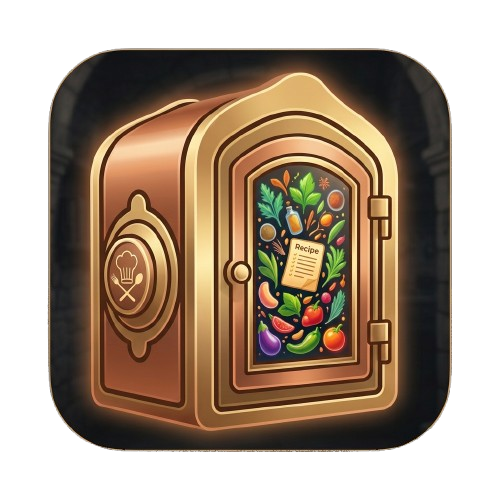
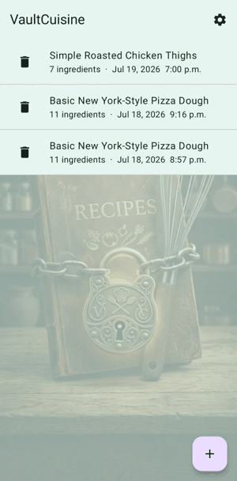

# VaultCuisine

<p align="center">
  
</p>

An Android application that converts printed and handwritten recipe cards into editable, structured data. Text recognition runs locally on device by default. Cloud AI structuring is opt-in, requires a user-provided API key, and transmits compressed, EXIF-stripped images only after explicit consent.

## Core features

* **On-device text recognition:** Uses ML Kit OCR locally. Executes offline on supported devices without network calls.
* **Opt-in cloud AI structuring:** Connects to the Google Gemini API using a user-provided API key. Converts OCR text and images into structured fields including title, ingredients, instructions, and timers. Gated by a consent dialog prior to network transmission.
* **Offline heuristic fallback:** Uses regular expression parsing when no API key is configured or when the user declines the cloud consent prompt.
* **Inline recipe editing:** Supports editing text lines, adding or removing ingredient and instruction entries, and reordering items via drag-and-drop or a long-press menu.
* **Original photo rescan:** Re-runs AI structuring against the original stored photo without modifying existing edits until explicitly saved.
* **Manual retry control:** Provides a retry control on the review screen to resend the photo for another pass or retake the image.
* **Scaling and unit conversions:** Scales serving sizes and converts between metric and imperial units per recipe upon explicit request.
* **Local metadata:** Stores chef-written notes and star ratings locally on device.

## Processing architecture

```
Photo ──> ML Kit OCR (On-device, local) ──> Structuring engine
                                                 │
                                                 ├─ API key set + Consent granted
                                                 │  └─> Gemini API (Cloud)
                                                 │
                                                 └─ No key OR Consent declined
                                                    └─> Regex parser (Local)
                                                         │
                                                         ▼
                                                Editable review screen
                                                         │
                                                         ▼
                                                Local Room database
```

Scans present an editable review screen prior to saving to local storage.

## App preview

<p align="center">
  
</p>

## Tech stack

* **Language and UI:** Kotlin, Jetpack Compose
* **Local persistence:** Room database
* **On-device OCR:** ML Kit Text Recognition v2
* **Cloud AI:** Google Gemini API via user-provided API key
* **Key security:** EncryptedSharedPreferences (transmits only to Google API endpoints for authentication)
* **Fallback engine:** Kotlin regular expression parser

## Requirements

* Android 8.0 or higher (API level 26)
* Optional: Google Gemini API key from ai.google.dev for cloud AI structuring. Scanning and heuristic parsing function without an API key.

## Project status and limitations

VaultCuisine is in early alpha testing. Current technical limitations include:

* **Handwriting recognition:** Accuracy varies based on card legibility. Mitigations include image contrast adjustments, JSON schema constraints on Gemini responses, and confidence-triggered retries.
* **Database migrations:** The app uses destructive migration (`fallbackToDestructiveMigration`). Schema updates clear local database tables during alpha testing.
* **Pending release blockers:** Live testing across target handwritten cards and replacing destructive migrations with explicit migration scripts.

## Planned development

* Implement explicit Room database migration scripts prior to public release.
* Add confidence-level visual indicators on the review screen interface.
* Add recipe export and print options.
* Add meal planning and pantry inventory tools.

## Privacy practices

* VaultCuisine collects no analytics and contains no advertisements, in-app purchases, or subscription code.
* On-device OCR processes image frames locally without network requests.
* Cloud processing runs only when an API key is present and the consent dialog is confirmed.
* Cloud requests strip EXIF metadata from uploaded images. Uploads route directly to Google API endpoints without intermediate servers.
* API keys are stored using `EncryptedSharedPreferences`.
* Review `PRIVACY.md` for complete data handling details.

## License

All Rights Reserved. See [LICENSE.md](LICENSE.md) for details.
